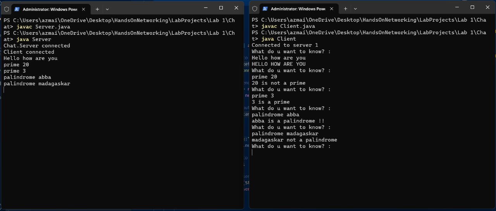

# Simple Java Client-Server Application

This repository contains a simple Java client-server application that allows communication between a client and a server over a network.

## Description

The application consists of two components:
- **Server**: A Java server application that listens for incoming client connections, processes client requests, and sends responses back to the clients.
- **Client**: A Java client application that connects to the server, sends requests, and displays responses received from the server.


## Usage
First clone the project to your local machine by running this command in the terminal

```bash
git clone git@github.com:TerrorBlood47/HandsOnNetworking.git
```

### Server

To run the server:

1. **Compile the `Server.java` file:**
    ```bash
    javac Server.java
    ```

2. **Run the compiled `Server` class:**
    ```bash
    java Server
    ```

The server will start listening for incoming client connections on a specified port (by default, port 15000).

### Client

To run the client:

1. **Compile the `Client.java` file:**
    ```bash
    javac Client.java
    ```

2. **Run the compiled `Client` class:**
    ```bash
    java Client
    ```

The client will attempt to connect to the server running on the specified IP address and port (by default, IP: 192.168.1.102, Port: 15000). Ensure that the server is running and accessible from the client machine.

These commands assume that you have Java Development Kit (JDK) installed on your system and that you're running them in the directory where your `Server.java` and `Client.java` files are located. Adjust the IP address and port in the code as necessary for your specific configuration.


## Customization

You can customize the server IP address and port in the `Server.java` and `Client.java` files according to your requirements.

## Requirements

- Java Development Kit (JDK) installed on your system.
- Basic understanding of Java socket programming.

## Contributing

Contributions are welcome! If you find any issues or want to enhance the functionality, feel free to submit a pull request.

## License

This project is licensed under the [MIT License](LICENSE).
